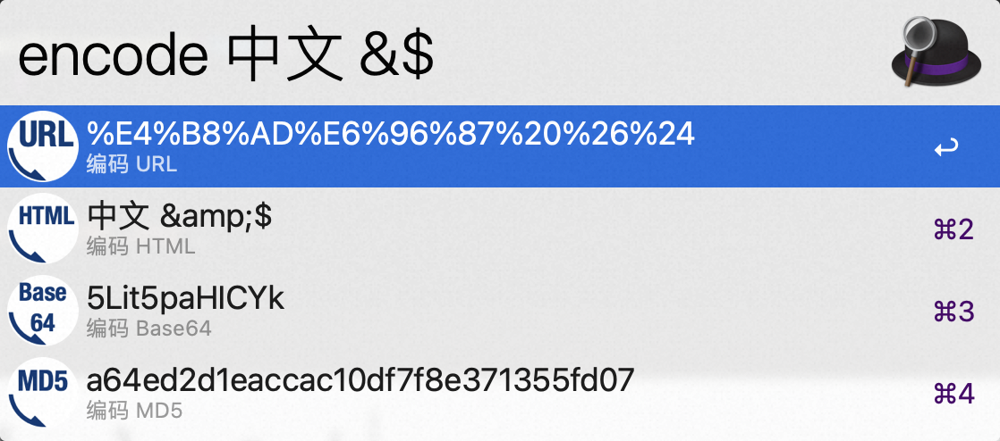
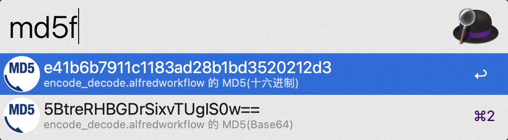
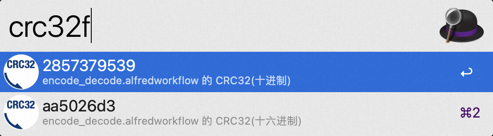

# Alfred-Workflow-Encode_Decode

编码和解码字符串的 Alfred Workflow，目前支持：

- URL
- HTML 实体
- Base64
- MD5
- CRC32

[⤓ 下载 Workflow](https://github.com/CYJB/Alfred-Workflow-Encode_Decode/releases/latest/download/encode_decode.alfredworkflow)

## 使用方法

使用 `encode` 关键字生成对指定文本编码，并复制到剪贴板。这里只会列出成功编码且与原始字符串不同的项。

使用 `decode` 关键字生成对指定文本解码，并复制到剪贴板。这里只会列出成功解码且与原始字符串不同的项。

使用 `md5` 关键字计算指定文本的 MD5，并复制到剪贴板。

使用 `md5f` 关键字计算访达中当前选择文件的内容 MD5，并复制到剪贴板。

使用 `crc32` 关键字计算指定文本的 CRC32，并复制到剪贴板。

使用 `crc32f` 关键字计算访达中当前选择文件的内容 CRC32，并复制到剪贴板。

